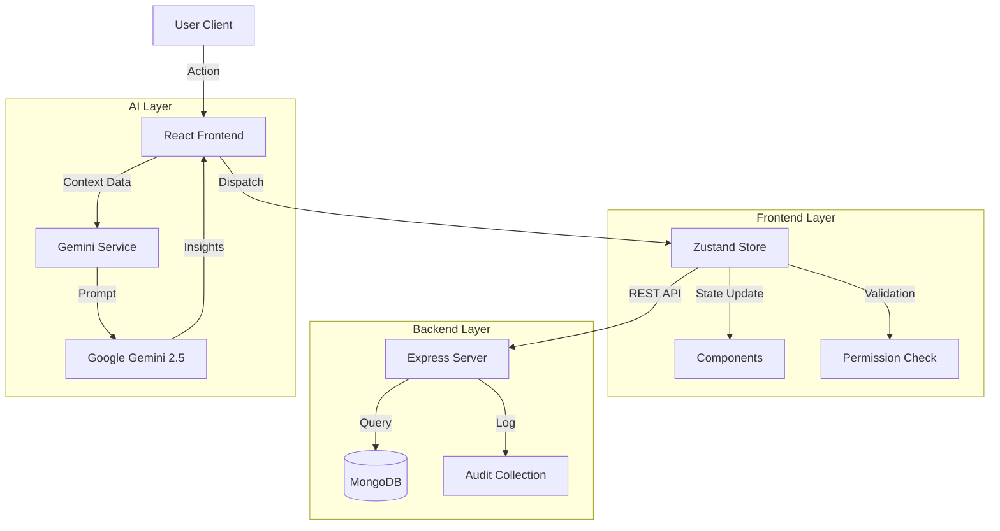

# 🏗 System Architecture & Design

## Logic Flow

The application follows a unidirectional data flow architecture, enhanced by a centralized store that synchronizes with the backend.

## AI Integration Strategy

We utilize **Retrieval-Augmented Generation (RAG)** principles on a small scale:

1.  **Context Aggregation:** The frontend serializes the current state (Employee salaries, Department distributions, Pending leave counts) into a minimal JSON structure.
2.  **Prompt Engineering:** A specialized prompt instructs the model to act as a "Senior HR Data Analyst."
3.  **Inference:** The model processes the JSON and returns HTML-formatted insights.
4.  **Feedback Loop:** High-risk insights (e.g., "High Burnout Risk in Engineering") automatically trigger system notifications to Administrators.

## Scalability Considerations

1.  **Optimistic UI Updates:** The `useStore` implementation updates the UI immediately while sending the API request in the background, ensuring a snappy experience.
2.  **Modular Services:** The `geminiService` and `mockData` are decoupled from the UI, allowing for easy replacement or upgrades.
3.  **Role Hierarchy:** The `Role` enum is extensible, allowing for future additions (e.g., `MANAGER`, `AUDITOR`) without refactoring the core logic.